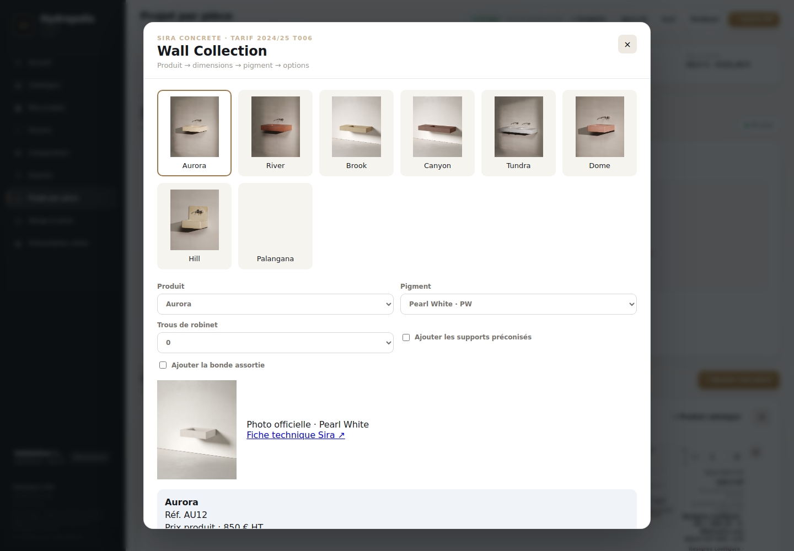

# Hydropolis Studio — consolidation 11.56.1

Rapport du 1er octobre 2026. Base : `979b405` (11.56.0). Branche : `v11.56.1-consolidated-fix`.

Le travail conservé a été récupéré depuis les deux copies locales. L’état antérieur reste sauvegardé dans `backup/official-assets-20260930` (commit local `8b72bf9`) ; la consolidation reprend la version mémoire 11.56.0. Aucun script de patch n’est exécuté au build. Le 1er octobre, l’utilisateur a ensuite demandé explicitement le déploiement de cette version.

## A. Causes identifiées

- Deux traitements de cartes parcouraient les quelque 94 000 articles pour chaque carte. Les accès sont désormais indexés, avec pagination de 48 cartes, temporisation de la recherche et chargement des catalogues par petits lots.
- Gessi reconstruisait des chemins d’images non garantis. Le resolver utilise maintenant `specificFeatureProductImg` retourné par l’API officielle pour l’article et sa finition.
- Sira utilisait des images génériques et des URL de modèles incorrectes. Les 26 pages et leurs variations WooCommerce ont été relues ; Oasis et les deux références Arctic sans vasque ont été corrigées.
- Resigres : deux parents URBAN partageaient la même clé fabricant/référence. La catégorie distingue maintenant ces parents ; les 38 lignes sources sont conservées.
- Des packs compressés, visuels Nicolazzi et caches HTML étaient encore conservés en RAM. Les images des packs sont désormais décodées progressivement ; les caches distants conservent des métadonnées, avec limite et expiration.
- Cause exacte des 403 Render ALPI/Sira : **NON VÉRIFIÉE**. Les essais User-Agent/Referer ne permettent pas d’attribuer le refus à un facteur précis. La nouvelle interface charge directement les URL officielles, sans Referer, et conserve un proxy en flux pour les usages qui en ont besoin.

## B. Fichiers concernés

- Serveur : `official-assets-server.js`, `metadata-cache.js`, `packed-assets.js`, `assets-server.js`, `server.js`, `memory-safe-server.js`, `tariff-server.js`.
- Interface : `public/app.js`, `catalog-index.js`, `official-media.js`, `rough-in.js`, `sira-configurator.js`, `index.html`, `styles.css`, `sw.js` et manifestes.
- Métadonnées : index officiels ALPI/Sira, correspondances ALPI/corps, index Nicolazzi sans images, types MIME des packs. Les prix ALPI existants et leur remise de 55 % sont conservés.
- Build : `package.json`, verrou npm, `render.yaml`, `verify-release.js` devenu strictement lecteur.
- Validation : tests consolidés, navigateur, réseau/mémoire et extraits officiels dans `tests/fixtures/official`; preuves dans `docs/`.
- Supprimés : ancien module ALPI parallèle et deux tests statiques de versions remplacés par la suite active. Les autres scripts historiques demeurent archivés et ne participent pas au build.

## C. Architecture avant / après

| Domaine | Avant | Après |
|---|---|---|
| Recherche | Boucles répétées sur tout le catalogue | Index navigateur, recherche locale, pagination |
| Assets | Routes et formats concurrents, URL Gessi déduites | ManufacturerAssetResolver commun, adaptateurs spécifiques |
| Photos | Proxy/buffers et encodages Base64 résiduels | URL officielles directes ; proxy en flux annulable |
| Cache | HTML et gros packs parsés persistants | Métadonnées TTL 2 h, 120 entrées par cache ; packs sans cache |
| Corps obligatoires | Injection au build | Réconciliation native à l’ajout et au chargement du projet |
| Version | Valeurs divergentes | package.json pour UI, API, manifests et SW |
| SW | Risque d’anciens catalogues | Réseau prioritaire, caches de version précédente supprimés |

La conversion des PDF et la simulation de finition Hotbath conservent nécessairement des buffers temporaires pendant le rendu. Ils ne sont pas mis en cache ; les entrées sont bornées. Ces opérations graphiques ne sont pas incluses dans le profil mémoire ci-dessous.

## D. Tests

- `npm run build` : **PASS**, syntaxe de 18 fichiers, vérification release pure, **16/16 tests**.
- Navigateur Chromium : **PASS**, 28 contrôles, aucune erreur JavaScript. Photos officielles déjà téléchargées et réponses fabricant enregistrées utilisées pour rendre les scénarios reproductibles.
- Resigres Selene : formes, matière, couleur, nombre de vasques, dimensions 50 × 100, option comprise et supplément payant ; 570 € puis 636 €, configuration conservée au projet.
- Recor : ajout d’une baignoire et de pieds compatibles. Source 196 lignes, 192 références distinctes ; aucun retrait.
- Corps : ALPI, Coalbrook, Hotbath, Zucchetti ; quantité synchronisée, prix sans double comptage, suppression/idempotence, exception Lefroy conservée.
- ALPI 10 références de collections différentes, Gessi 10 articles × au moins 3 finitions, Sira 26 × 12 associations pigment/photo.
- HTTP réel : **117 URL d’images, 117 réponses 200**, depuis cet environnement ; détail dans `image-url-validation.json`.
- Packs : comparaison des octets sur premier/milieu/dernier élément des six packs et du pack Nicolazzi ; erreurs, ressource absente et annulation testées.
- Version : interface, API, health, manifests et SW cohérents. SW réseau prioritaire et nettoyage testés.
- Essai réseau intégré : échecs DNS `EAI_AGAIN` dans cet environnement. `live-validation.json` conserve ces échecs ; **ce fichier ne constitue pas une validation réussie de Render**.

Mesure navigateur contrôlée, catalogue entièrement chargé : 11.56.0 rendait 120 cartes en 4 426–5 730 ms. Cette version rend 48 cartes en 13.2–18.5 ms. Le chargement complet est passé de 11 637 à 3114 ms. Ces mesures locales ne préjugent pas de la vitesse sur le poste utilisateur ou Render.

## E. Références disponibles dans le navigateur

| Fabricant | Entrées distinctes / parents |
|---|---:|
| Amphora | 171 |
| Coalbrook | 1 483 |
| Alpi | 3 041 |
| Catalano | 1 430 |
| Nicolazzi | 36 303 |
| Hotbath | 2 554 |
| Lefroy Brooks | 3 397 |
| Gessi | 16 211 |
| Ritmonio | 16 082 |
| Recor | 192 |
| Fioranese | 1 135 |
| Resigres | 38 |
| Vismaravetro | 15 |
| TDA | 20 |
| Sira Concrete | 5 |
| Zucchetti | 12 053 |
| **Total** | **94 130** |

Sira : 5 familles configurables représentant 26 modèles. Resigres : 38 parents configurables, sans aplatissement des variations. Recor : 196 lignes sources, dont 4 doublons de référence préexistants. Les autres catalogues et tarifs ne sont pas modifiés.

## F. Mémoire

Mesure Node sans GC forcé, application réelle, 100 requêtes réussies utilisant les réponses officielles enregistrées. Les catalogues sont téléchargés sans reconstruire un index serveur. Quatre ressources locales compressées sont aussi servies, puis TDA est chargé. Détails dans `memory-validation.json`.

| Phase | RSS Mo | Heap utilisé Mo |
|---|---:|---:|
| startup | 66.7 | 17.7 |
| catalogues | 85.4 | 20.5 |
| assets locaux streamés | 105.2 | 28 |
| 50 recherches | 107.6 | 24.5 |
| 100 recherches | 109.8 | 24.8 |
| TDA chargé | 255.5 | 102.4 |
| repos 30 s | 206.1 | 75.1 |
| repos 60 s | 206.1 | 75.4 |
| repos 90 s | 206.1 | 75.3 |
| repos 120 s | 89.3 | 20.6 |
| repos 150 s | 89.3 | 20.6 |
| repos 180 s | 89.3 | 20.7 |

TDA est libéré après 60 secondes d’inactivité ; la mémoire redescend ensuite lors du GC normal. Caches officiels : 10 ALPI, 10 Gessi, 26 Sira, uniquement métadonnées. Packs conservés : zéro.

Au démarrage local, la base 11.56.0 mesurait 66 Mo RSS / 16,9 Mo heap. La production existante a été observée à 83,5 Mo RSS / 19,8 Mo heap le 1er octobre avant déploiement ; cette lecture n’est pas une charge comparable. Un profil de charge complet sur Render est **NON VÉRIFIÉ**.

## G. ALPI

3 041 entrées, prix d’origine et remise 55 % conservés. 1 556 références ont une correspondance unique dans l’index officiel relevé ; les autres restent sans photo certifiée. Pas de correspondance inventée entre ensemble complet et façade, ni de site tiers.

Les 10 contrôles portent sur AC126CR, AC132CR, AL98176CR, AUO301, BU85106CR, PO020CRMTL, FA01TP, FDORE10SBI, FDP04CRBI et GN99106CR. Photo et dessin 2D officiels retrouvés. Un dessin JPG est annoncé comme image technique, pas comme PDF fictif. La finition est signalée générique lorsqu’elle n’est pas certifiée par la référence officielle.

90 façades disposent d’un corps obligatoire chiffré à partir des 8 références du tarif. 35 autres exigences officielles n’ont pas de prix vérifié : avertissement affiché, aucune ligne gratuite fabriquée.

Sources : [produits ALPI](https://alpirubinetterie.com/prodotti/), [corps lavabo](https://alpirubinetterie.com/wp-content/uploads/2025/05/Alpi_ListinoIncassiLavabo.pdf), [corps douche](https://alpirubinetterie.com/wp-content/uploads/2025/05/Alpi_ListinoIncassiDoccia.pdf).

## H. Gessi

16 211 références conservées. Dix articles contrôlés : 11922, 33605, 44838, 54336, 58144, 63331, 66134, 73588, 75002, 75051. Les URL sont celles renvoyées par l’API et changent avec les trois finitions vérifiées par article. Logos rejetés, finition inconnue sans remplacement trompeur. 100 demandes simultanées d’un article réutilisent un seul chargement.

Source : [API officielle Gessi, exemple 75051](https://g-ecatalogue-be-prod-we.azurewebsites.net/public/product/GetProductDetails?country=FR&language=fr&productCode=75051). Documents Gessi : **NON VÉRIFIÉS**, aucune URL inventée.

## I. Sira

26 modèles : Bench 9, Wall 8, Freestanding 2, Bathtub 3, Arctic 4. Chaque modèle a une miniature officielle. Les 312 associations modèle/pigment sont testées depuis les données WooCommerce réelles. Deux pigments par modèle ont fait l’objet de contrôles HTTP ; les 312 téléchargements individuels n’ont pas tous été testés.

Le changement PW → OB est testé dans les cinq familles et la photo choisie reste attachée au projet. AR3 désigne le plan sans vasque ; AR4 le plan avec retombée sans vasque. Les liens de fiches techniques des 26 modèles sont extraits des pages officielles. Sources détaillées : `public/sira_models.json` et README des fixtures.

## J. Limites avant exploitation

- 403 depuis Render et accès de tous les postes clients : **NON VÉRIFIÉS**. Ne pas annoncer le problème réseau définitivement résolu sans contrôle en production.
- Pas de preview Render disponible dans les outils de cette session. Les vérifications ci-dessus sont locales ; la publication doit être suivie de la lecture de `/api/version` et `/api/health`.
- Contrôle exhaustif de chaque variante des autres configurateurs, PDF exportés et simulation Hotbath : **NON VÉRIFIÉ** ; parcours représentatifs et conservation des données vérifiés.
- Les métadonnées ALPI sont un relevé daté ; une évolution du site peut nécessiter une actualisation de l’index.
- Décompresser à la demande réduit la RAM durable au prix de lectures/CPU supplémentaires pour les ressources locales rarement ouvertes.

Confiance : **élevée sur les résultats locaux cités**, **limitée sur le réseau Render et la couverture totale des assets fabricants**. Aucun résultat non mesuré n’est présenté comme validé.
